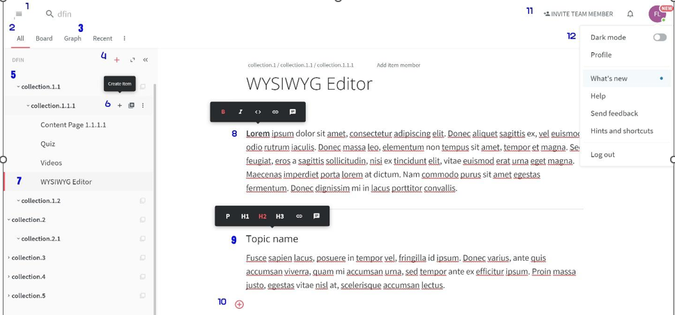

# React Web App build as per the below requirement provided by Start-Up

## Assignment

The assignment is to build a responsive SPA (using ReactJs - no JQuery) that renders a static version of the screenshot provided below. The look and feel of the app should match with how the screenshot (provided below) looks and functionally provides the following capabilities :

### ● Mandatory
   - Add remove nodes to the tree structure on  the left panel
   - There are two types of nodes, a container node, and a leaf node. As the name suggests container nodes contain other nodes while a leaf node doesn't.
   - Each node will have unique content associated with it. Content is a generic object that could be anything. It could be a text, image, video, 3D diagram, custom-activity, etc.
   - The tree structure and the content should be saved in the localStorage and retrieved from the same. No need to integrate with any APIs.
   - Static menu popups that come up on hover of certain UI elements 

### ● Optional
  - Clicking on the node will open a WYSIWYG editor on the right panel to edit the content
  - The editor should be like a Medium editor (on Google check for WYSIWYG editors). 
  - The editor will have provisions to add different types of content. I am not expecting the app to support all types of content; just a couple of types will do.

### ● Editor ScreenShot
  Here is a screenshot of one of the views that is part of our authoring platform. This screenshot is created to provide an idea of how the editor looks. There are quite a few other features that are planned for the final product but this is just a sample.
   
 

  1. Hamburger Menu – Provides options for users to switch modules – Onclick opens a drawer
1. Items render options. Allows to switch between a tree view to a graph view. 
2. Graph view of the items (just a tab - no need to have any functional view)
3. Controls to add containers
4. Hierarchical view of the items
5. Controls to add items to containers
6. Current active item
7. Editing options available to format a word
8. Formatting options for the section heading
9.  Providing options to add widgets like Video, Assessment-Item, etc.
10. Option to invite more team members for collaboration 
11. User options to update the profile, switch the authoring-theme, logout, etc.

